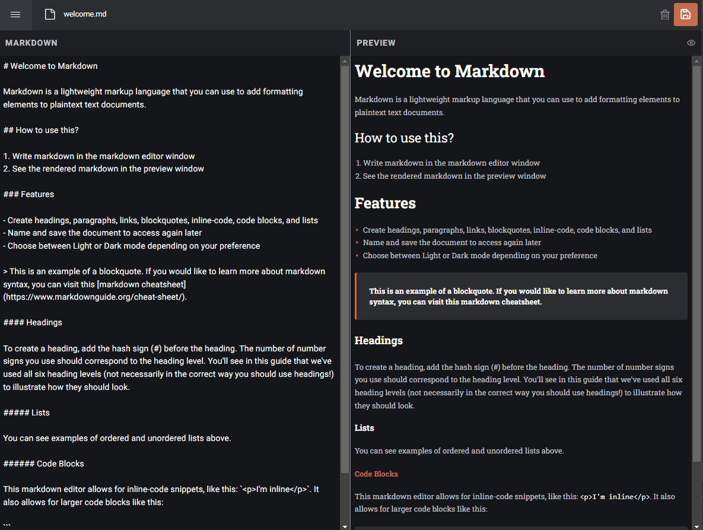

<p align="center">
  <a href="https://bill-generator-kappa.vercel.app/" style="text-decoration: none;">
    
  </a>
</p>

# Markdown Editor

This project is a Markdown Editor, meticulously crafted with the powerful combination of Next.js, TypeScript, NextAuth.js, Zustand, and server side components. Originally sourced from a personal project, this Markdown Editor was developed with the primary goal of honing development skills and gaining practical experience.

This Markdown Editor is designed to be a versatile tool for anyone seeking a quick and efficient way to create and edit Markdown documents. It's more than just a digital canvas—it's a comprehensive solution for managing and organizing your Markdown files. The project's roadmap includes plans for expansion, introducing user authentication features and various other enhancements in the future.

## Table of Contents

- [Getting Started](#getting-started)
- [Built With](#built-with)
- [Prerequisites](#Prerequisites)

## Screenshot



### Built with

- Semantic HTML5 markup
- Zustand
- Mobile-first approach
- Responsive design
- [Next JS](https://nextjs.org/) - JS library
- [TypeScript](https://www.typescriptlang.org/)
- [TailwindCSS](https://tailwindcss.com/) - For styles
- [Vercel](https://vercel.com/) - Deployment

## Local Development Setup
Markdown Editor is fully on your computer and requires each dependency (for example MongoDB) to be installed in order to start the local development.

### 0. Prerequisites
* [Mongodb](https://www.mongodb.com/)
* Follow the instructions in the [MongoDB setup guide](MONGODB_GUIDE.md) to set up your MongoDB Atlas database.
* [Google Cloud](https://cloud.google.com/)
* Follow the instructions in the [Google Cloud setup guide](GOOGLE_SETUP.md) to set up your Google Cloud project.


### 1. Fork and clone the repository

Follow [these steps](https://docs.github.com/en/free-pro-team@latest/github/getting-started-with-github/fork-a-repo) to create a fork of this repository and then clone it to your local machine. 

```shell
git clone https://github.com/HpatricioH/markdown-editor.git
```

### 2. Navigate to the repo directory

After cloning move into the cloned repo:

```shell
cd markdown-editor
```

### 3. Install dependencies

#### Installing `node`:

If you have node already installed in your computer you can avoid this step. To install `node` [download the installer](https://nodejs.org/en/) from their site. Please download the lates and [LTS version](https://nodejs.org/en).

#### Installing `pnpm`:

`pnpm` is a package manager that is used to install all dependencies needed.

If you would like to read more about `pnpm` you can visit [their documentation](https://pnpm.io/motivation).

The best way to install `pnpm` for this project is by using [Corepack](https://nodejs.org/api/corepack.html), a new feature bundled with Node.

Install pnpm with the following commands (there are more ways to install 'pnpm' if you prefer to use a different method please visit [pnpm's installation page](https://pnpm.io/installation)):

```sh
npm install -g pnpm
```

#### Setting up your .env

Use the following command to create a local `.env` file. Then open the new file (`.env`) to make any changes required in the document.

```shell
cp .env.example .env
```

#### Installing package dependencies

Once you have `node`, `pnpm` installed, please run the following command to install all dependencies:

```shell
pnpm install
```

After running the command above, you should see a `node_modules` folder in your project root. This is where all the dependencies are installed. At this point you can run the project locally using the following command:

```shell
pnpm dev
```

Once you run this command, a local server is running at http://localhost:3000 any changes that you make to the code will be reflected on the browser automatically.

